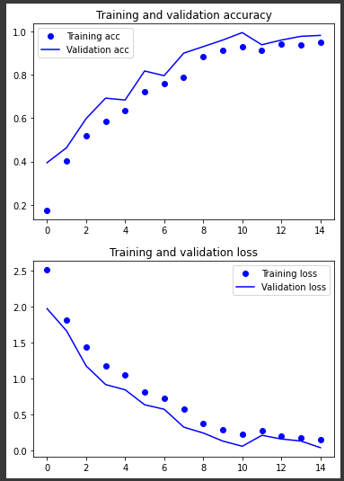
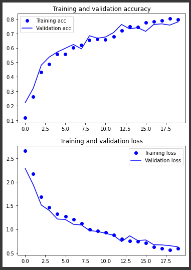
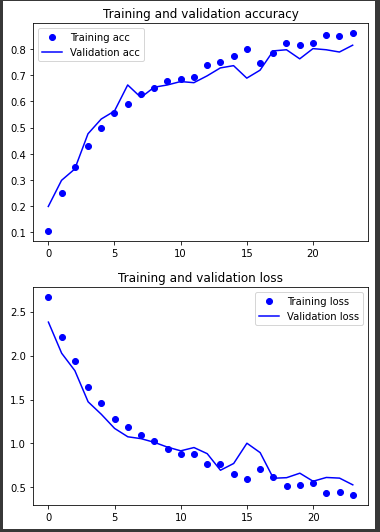
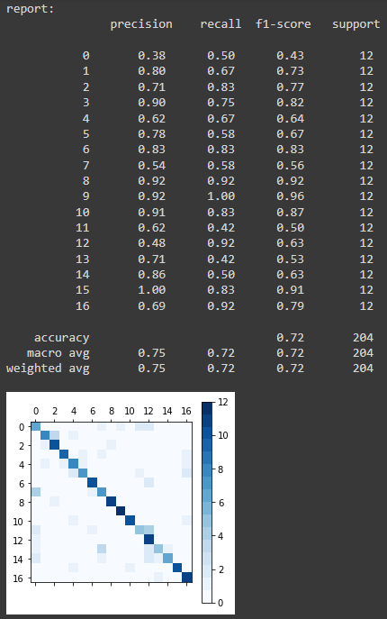

# Interview Test

@matildaopane

# Questions

<strong>The code you used to train the model. </strong> 
 
You can find the commented code inside the Jupyter Notebook, you can open it using Google Colab.

-----

<strong>Provide a report concerning the training of the model, including: 
your decisions and steps you took
short assessment of the model’s performance
</strong>

# Feasibility Test Report

In this report I describe the various step I took to train a neural network using the dataset provided.

The aim of this task was to asses the feasibility of training a dataset using the given dataset.
The contest is a fast and proof of feasibility of how this dataset can perform in a real case scenario.

I immagined to be in a real situation, where time management is a priority. 
I did not focus on obtaining the best and accurate results but to see how this dataset can be manipulated or integrated in a training pipeline.

Because of the time limit and the dimension of the dataset I decided to train a simple network from scratch instead of fine tuning and existing network.

The architecture of the network is the following:

This architecture is simple and not very complex but takes inspiration from the structure of the most famous and performing ones like AlexNet and VGG16.
The number of parameters is much less than the VGG networks (approx 140 millions).

The normalization layer (Rescaling) converts the values of the images from [0-255] to [0-1] to have smaller values inside the network.

## Hyperparameters

DATASET BALANCE: 

This dataset came with the same amount of samples for each class. There was no need to apply over or under sampling on any category.
The dataset contains 80 samples for each class, it is a small dataset, there is a high chance that we will face overfitting.

DATASET SPLITS:

- Original dataset samples: 1360
- Training dataset: 1156
- Test dataset: 204

After this first split I extracted the validation split from the training set. 

- Final training samples: 925
- Validation samples: 231

BATCH_SIZE = 32.

I opted for a small batch size for a faster training at cost of noise during the training and because the dataset is not big.

EPOCHS = [10-24]. 

During firsts experiments I saw that at least 10 epochs were necessary to see the increase of the performances. After some trial and error 24 epochs where a good compromise beetween results and training time.

OPTIMIZER:

Try between Adam and RMSprop.
The optimizer updates the model's weights to reduce the error between the predicted output and the true output by adjusting the weights of the model's neurons through backpropagation.

ACTIVATION FUNCTIONS:

The activation function for the convolutional layers used is ReLU. When the input is negative, ReLU sets the output to zero, which avoids the vanishing gradient problem. The vanishing gradient problem occurs when the gradients in a deep neural network become too small, making it difficult for the network to learn and update the weights.

Since this is a multiclass problem I used the SOFTMAX as activation function to convert the output of the last layer of the network, which can be a set of arbitrary real numbers, into a probability distribution over the different classes. The output of the softmax function represents the likelihood of the input belonging to each class. The class with the highest probability is then selected as the predicted class.

## First training results
 

A result good as this one at the first attempt is suspicious. 
 
Dropout | Data aug | Epochs | Opt |Train Loss | Val Loss | Train Acc | Val Acc | TEST ACC
--- | --- | --- | --- | --- | --- | --- | --- | --- |
y | n | 10 | Adam |0.0579|0.0569|0.9816|0.9827|0.62
 
Seeing the accuracy from the test dataset we see that the model is not capable to generalize. 
The cause of very good training accuracy, good validation accuracy and bad test accuracy could come from an unrepresentative dataset or overfitting given by too few data in the dataset.

## Resolve overfitting

To overcome this, I applied two of the most used techniques to resolve overfitting.

I added a Dropout layer and a RandomFlip and RandomRotaion layers at the beginning of the architecture.

### Dropout
Adding a dropout regularization layer improved the generalization capacity of the model.

Dropout | Data aug | Epochs | Opt |Train Loss | Val Loss | Train Acc | Val Acc | TEST ACC
--- | --- | --- | --- | --- | --- | --- | --- | --- |
y | n | 15 | Adam | 0.1482  |   0.0410  |  0.9514 | 0.9827  | 0.65  |
 
These results can be improved.

### Data Augmentation:

I added 2 layers of data augmentation to increase the number of the samples seen by the model modifing the original images.
I applied RandomFlip and RandomRotation which are techniques used to randomly flip the images horizontally or vertically and randomly rotate the images by a certain angle during training. 
This helps the model to learn invariance to image orientation and can also increase the size of the training data.  
 

Dropout | Data aug | Epochs | Opt |Train Loss | Val Loss | Train Acc | Val Acc | TEST ACC
--- | --- | --- | --- | --- | --- | --- | --- | --- |
y | y | 20 | Adam | 0.5909 |  0.6260 | 0.7968 | 0.7792 | 0.72  |
 

## Final results
The final metrics are calculated over the test set, a set that the network never saw before. I choose betweem the best optimizer between adam and RMSprop and a slightly bigger number of epochs.

Plot of the training history using Adam opt:

Dropout | Data aug | Epochs | Opt |Train Loss | Val Loss | Train Acc | Val Acc | TEST ACC
--- | --- | --- | --- | --- | --- | --- | --- | --- |
y | y | 24 | Adam | 0.4151 | 0.5298 | 0.8595 | 0.8139 | 0.72  |   
y | y | 24 | RMSprop | 0.5696 | 1.0607 | 0.8173 | 0.6537 | 0.61  |

The training with the RMSprop optimizer is very noisy and lead to worse results, so I select the Adam opt.

From the confusion matrix we can see that the number of true positive for the different 17 classes are higher in the diagonal that the ones outside the diagonal. 

-----

<strong>What would your comments be to a colleague building the app, regarding the model?  </strong>

If the app is for a mobile phone, it is necessary to build a lighweight architecture which could run in real time and that takes less memory as possible for performances reasons. Some existing models can be usefull but are trained to recognize much more objects than the ones we require and some of them are very complex. 

Take in consideration to not train from scratch but to transfer the learning from a pretrained model. 

Take in consideration to infer on cloud. Locate the model in a server accesible from the mobile devices and let the server do the inference for faster results, take in consideration that this require internet connection and an image transfer from device to the server.

To avoid network overloading some preprocessing could be made on the device and then send the data in a lighter format to the server.
I would also consider finding a more populated dataset with more images per classes to let the model face more samples.

